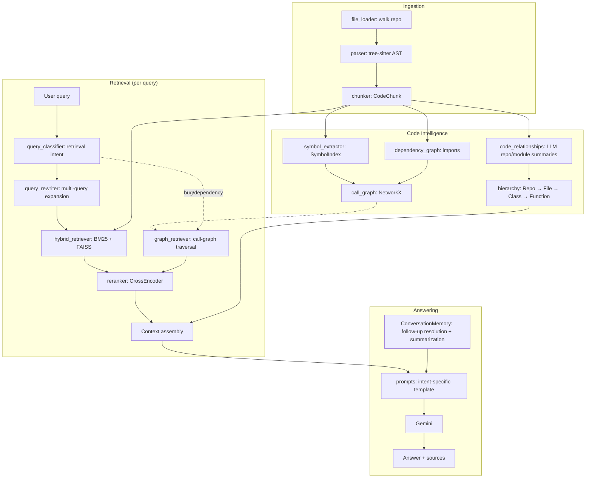

# 🧭 Codebase Mentor

An AI assistant that actually understands the *structure* of a codebase, not just its text.

Point it at any local repository and it builds a **code-intelligence layer** — AST-based
symbol extraction, a call/inheritance graph, a file/class/function hierarchy — on top of a
**hybrid retrieval pipeline** (BM25 + dense vectors + cross-encoder reranking), then answers
questions through an LLM with conversation memory and follow-up-question resolution.

[](https://github.com/Gaurav4421/codebase-mentor/actions/workflows/ci.yml)


---

## Why this exists

Plain "embed the code and do similarity search" RAG falls over on real codebases: it can't
tell you what calls what, it treats a config file the same as a core module, and it re-answers
every follow-up question from scratch. Codebase Mentor addresses each of those directly:

| Problem with naive code-RAG | How this project handles it |
|---|---|
| Embedding similarity misses exact symbol/file lookups | **Hybrid retrieval**: BM25 (keyword) + FAISS (dense) combined via an `EnsembleRetriever`, then **cross-encoder reranked** |
| One retrieval strategy for every question | A query is **classified into an intent** (code explanation, bug debugging, architecture, file search, dependency question, docs) and routed to a matching retrieval strategy |
| "Why does X fail?" needs the *call graph*, not just similar text | Bug-debugging / dependency questions traverse a **NetworkX call graph** built from tree-sitter (`calls`, `inherits`, `imports`) before falling back to hybrid search |
| No sense of the repo as a whole | An LLM-generated **repository + per-module summary** is injected into every prompt's context |
| "What about *that* one?" breaks retrieval | **Conversation memory** rewrites follow-up questions into standalone queries, and summarizes old turns instead of dropping them |

## Architecture



## Features

- **Multi-language AST parsing** via tree-sitter — Python, JS/TS, Java, C/C++, Go, Rust, plus
  config/docs (JSON/YAML/Markdown) for context.
- **Hybrid retrieval**: keyword (BM25) + dense (`bge-small-en-v1.5`) search combined, then
  reranked with a `bge-reranker-base` cross-encoder.
- **Code intelligence**: symbol index, import-based dependency graph, and a call/inheritance
  graph — used to answer structural questions ("what calls `predict()`?") that pure text
  search can't.
- **Adaptive, intent-aware retrieval** — six query intents each get a different retrieval
  strategy instead of one-size-fits-all.
- **Conversation memory** with automatic follow-up rewriting and history summarization, so
  long sessions don't blow the context window or lose earlier facts.
- **Two interfaces**: a Streamlit chat UI and a scriptable terminal CLI.
- **A real evaluation harness** (`benchmark.py`) scoring retrieval hit-rate and answer
  grounding against a set of test questions — not just a demo.
- Dependency-injected `LLMClient` protocol + a `FakeLLMClient` test double, so the whole
  pipeline is unit-testable without hitting a real API.

## Quickstart

```bash
git clone https://github.com/YOUR_USERNAME/codebase-mentor.git
cd codebase-mentor
python -m venv .venv && source .venv/bin/activate
pip install -r requirements.txt

cp .env.example .env   # then add your GEMINI_API_KEY
```

**Chat UI:**
```bash
streamlit run streamlit_app.py
```

**Terminal:**
```bash
python cli.py index /path/to/some/repo
python cli.py index /path/to/some/repo --ask "What does the parser module do?"
```

**Docker:**
```bash
export GEMINI_API_KEY=your_key
export REPO_TO_INDEX=/path/to/repo/to/index
docker compose up --build
# open http://localhost:8501
```

## Evaluation

```bash
python benchmark.py /path/to/repo --json-out results.json
```

Runs a small suite of (question, expected file/symbol) cases against a live index and reports
retrieval hit-rate and answer-grounding rate — see `benchmark.py` for the methodology and why
it deliberately avoids LLM-graded scoring.

## Testing

```bash
pip install -r requirements-dev.txt

pytest              # fast unit tests (no model downloads, no API key) — runs in CI
pytest -m integration   # + a full end-to-end pipeline test (downloads embedding/reranker models)
```

Unit tests cover language detection, file loading, symbol extraction, and conversation memory
(follow-up resolution, summarization, graceful LLM-failure handling) using `FakeLLMClient`.
The integration test exercises the real chunker → hybrid index → adaptive retrieval → prompt
pipeline end-to-end with a faked LLM call.

## Project structure

```
ingestion/          file walking, tree-sitter parsing, chunking into CodeChunk
code_intelligence/  symbol index, dependency graph, call graph, LLM repo/module summaries
retrieval/          BM25, FAISS, reranker, query classifier/rewriter, adaptive retriever
llm/                LLMClient protocol, Gemini implementation, FakeLLMClient, prompt templates
memory/             conversation history, follow-up resolution, summarization
pipeline.py         wires everything into CodebaseMentor (the single entrypoint class)
streamlit_app.py    chat UI
cli.py              terminal UI
benchmark.py        retrieval/grounding evaluation harness
tests/              unit tests + one gated integration test
```

## Design notes & trade-offs

- **Call/inheritance resolution is name-based, not type-inferred.** Full cross-file type
  inference is out of scope for a language-agnostic tool; ambiguous calls fall back to "any
  symbol with this name," which is documented in `code_intelligence/call_graph.py`.
- **Two separate classifiers** (`retrieval/query_classifier.py` for retrieval *strategy* vs.
  `llm/prompts.classify_intent` for prompt *template*) are intentionally kept apart — they
  often agree but not always, and conflating them would silently couple two concerns.
- **Evaluation is exact-match, not LLM-graded**, on purpose: it's a more trustworthy first
  signal than asking another model to judge correctness.

## Known limitations / roadmap

- Import/call resolution is heuristic (see above) — no full static type checker.
- Only tested at the scale of small-to-medium repositories; very large monorepos would need
  incremental indexing and vector-store persistence (currently rebuilt per session).
- Single LLM provider (Gemini) is wired up; swapping providers means implementing the
  `LLMClient` protocol in `llm/models.py`.
- No auth/multi-user support — this is a single-user local tool, not a hosted SaaS.

## Troubleshooting

**`ModuleNotFoundError: No module named 'tree_sitter_languages'`**
That package is unmaintained and has no wheels for Python 3.13+. This project uses the
actively maintained `tree-sitter-language-pack` instead (already in `requirements.txt`) —
just make sure you're installing from this repo's `requirements.txt`, not an older copy.

**`error: resolution-too-deep` during `pip install`**
This means pip's resolver is exploring too large a dependency space — almost always because
of (a) installing into a system/conda `base` environment instead of a virtualenv, and/or
(b) very new Python versions (3.14+) where some ML packages (`faiss-cpu`,
`sentence-transformers`) don't have wheels yet. Fix:
```bash
python3.12 -m venv .venv   # 3.11/3.12 recommended over 3.13/3.14 for now
source .venv/bin/activate
pip install -r requirements.txt
```
The LangChain family (`langchain`, `langchain-core`, `langchain-community`,
`langchain-classic`) is pinned to exact, mutually-compatible versions in
`requirements.txt` on purpose — don't loosen those pins unless you've verified a new
combination installs cleanly.

**`ResolutionImpossible` / conflicting `langchain-core` requirements**
As of mid-2026, `langchain-huggingface`'s latest release still requires `langchain-core<1.0.0`,
while `langchain-classic` (needed for `EnsembleRetriever`) requires `langchain-core>=1.0.0` —
those two genuinely cannot both be installed. This project avoids the conflict entirely by
using the `HuggingFaceEmbeddings` class still shipped inside `langchain-community` (deprecated
but functional, not removed until `langchain-community==1.0`) instead of the separate
`langchain-huggingface` package. If you see this error, make sure you're on the latest
`requirements.txt` from this repo (no `langchain-huggingface` entry).

## License

MIT — see [LICENSE](LICENSE).
